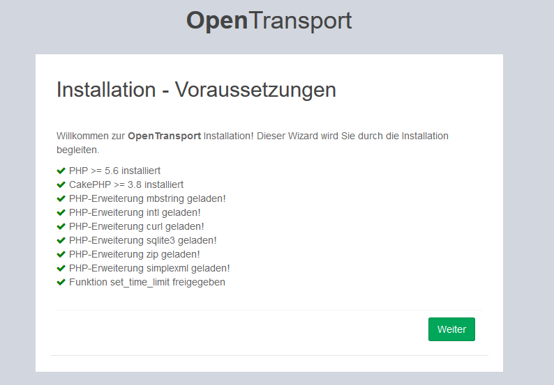
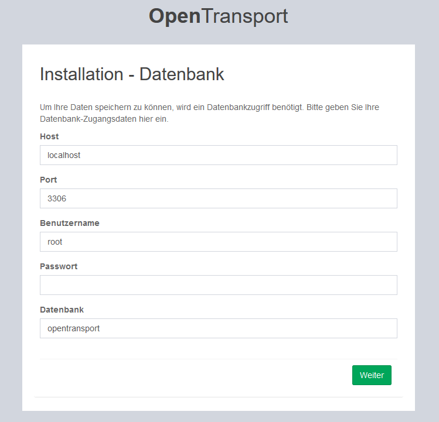
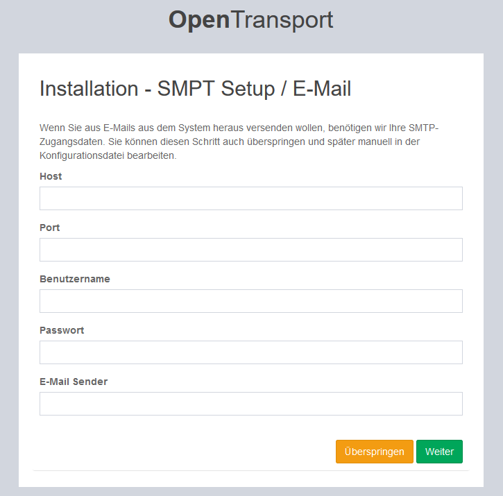
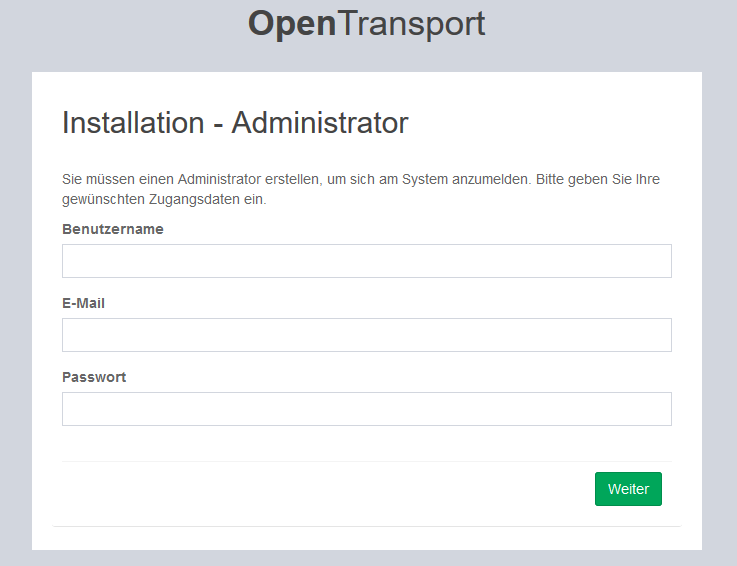
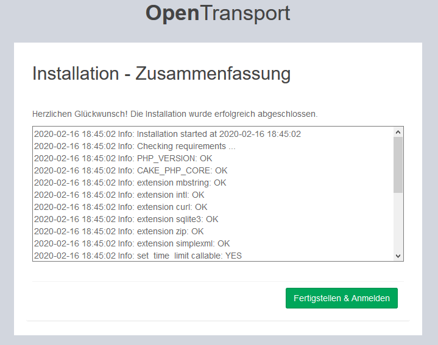

# Installation Guide

After you created the complete application package using Composer or PHP-Download, you should set your
environment specific variables. Take a look into `/config/.env.default` file to do this.
You don't need to rename the file, the web installer will to everything required for you.

When your setup is down, you can upload the whole application by using your FTP client.

## Web Installer
After you uploaded the whole application on your server open the app in your web browser. The installation wizard will start and guide you through the whole installation.

### Requirements
To ensure the app is working properly, there must be at least the following requirements:

*   CakePHP >= 3.7 (Uploaded with the application)
*   Enabled `mbstring` PHP extension
*   Enabled `intl` PHP extension

If you want to use all features without any limitations, the following packages are also required:

*   Enabled `curl` PHP extension
*   Enabled `sqlite3` PHP extension
*   Enabled `zip` PHP extension
*   Enabled `simplexml` PHP extension
*   Callable `set_time_limit` function

### Database 
To store your data anywhere, *OpenTransport* needs access to your database. Enter your database credentials in the upcoming form.

### SMTP / E-Mail
If you want to send emails from your app, you need to enter your SMTP credentials in the form below. You can also skip
this installation step and enter your credentials in the config file later manually.

### Admin User
To logon in the backend system, you need to create an admin user. Enter your desired credentials, this will create an admin user for you.

### Conclusion
After running the install wizard, you'll find a conclusion which states the correct installation. Take a look about and check
whether you can find any error or not. If you're fine with the installation, click `Finish & Login`.

## Configuration Files
You can find several configuration files in your [config](../config) directory. If you want to edit them manually, you should know what you're
doing here and always take backup of the files, since this can lead to critical issues.

*   `app.php` - This file contains basic settings for the whole application. It is highly discouraged to change the entries since this
    can lead to unknown behaviour of the app. 
    
*   `auth.php` - See basic authentication and authorization settings here.

*   `database.php` - This file contains your database credentials.

*   `email.php` - Contains email transport settings ans SMTP credentials.

*   `install.php` - DO NEVER MODIFY THIS FILE! It contains your installations status.

*   `queue.php` - Special settings for queued processes within the app.

*   `rest.php` - Settings for the REST API.

There're also many other configuration files, but they never should be touched by you.